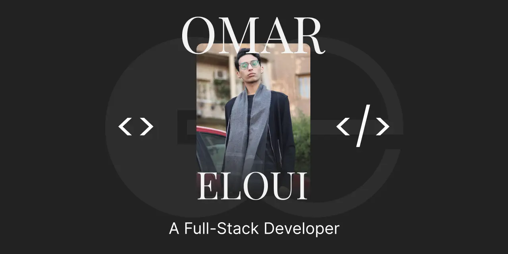

# My Portfolio

[](http://commitizen.github.io/cz-cli/)



My portfolio website.

## Setup

Clone this repo and cd into it.

```bash
git clone git@github.com:omareloui/Portfolio.git

cd Portfolio
```

Download the dependencies.

```bash
pnpm i
# or `npm i`
# or `yarn i`
```

To run in dev mode

```bash
pnpm dev
# or `npm run dev`
# or `yarn dev`
```

To build and preview

```bash
pnpm build && pnpm preview
# or `npm run dev && npm run preview`
# or `yarn dev && yarn preview`
```

---

## License

MIT.
